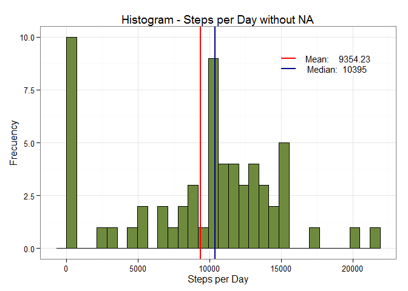
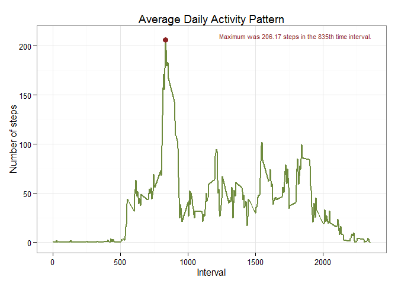
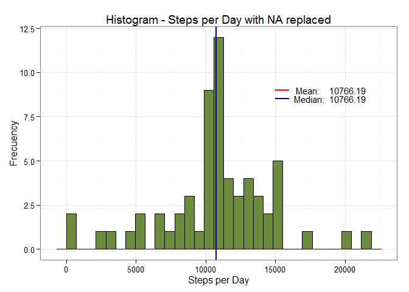
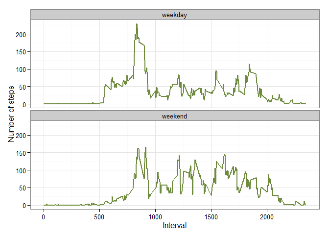

# Reproducible Research: Peer Assessment 1
Oscar Saul Navarro-Morato  
Thursday, June 11, 2015  

# Introduction

This document presents the results of the Reproducible Research's Peer Assessment 1 
in a report using **a R markdown document** that is processed by **knitr** and 
transformed into an HTML/pdf file.  

The assignment consists in use of data from a personal activity monitoring device. 
This device collects data at 5 minute intervals through out the day. The time-window 
covered by the data is two months from an anonymous individual, and include the 
number of steps taken in 5 minute intervals each day.

The variables included in this dataset are:

1. **steps**: Number of steps taking in a 5-minute interval (missing values are 
coded as NA) 
2. **date**: The date on which the measurement was taken in YYYY-MM-DD format 
3. **interval**: Identifier for the 5-minute interval in which measurement was taken

# Prepare the Environment

First, remove all variables from the environment and we set the chunks options with
`echo = TRUE` as global option among other for this document.  


```r
# Removes all variables from environment
rm (list = ls (all = TRUE)) 
```


```r
#  Setting chunks options
library(knitr)
opts_chunk$set(echo = TRUE, results = "markup", warning = FALSE, message = FALSE)
```

And finally should be loaded necessary "libraries" to perform the analysis.


```r
library(plyr)
library(dplyr)
library(ggplot2)
```

# Loading and preprocessing the data

In the second step the data is loaded ensuring that the "class" of each variable 
is correct.

## Create check-download-files function

Function check the existence of files in the path defined. In this case
the containing folder will be `./data/`. If don't exists stops execution of 
the current action, and execute the appropriate action to obtain the dataset.  


```r
load_data <- function() 
{       # Dataset check and load 
        data_dir <- paste(getwd(), "/data", sep = "")
        fileURL <- "https://d396qusza40orc.cloudfront.net/repdata%2Fdata%2Factivity.zip" 
        fileSource <-"activity.zip"
        
        source_path <- paste(data_dir, "/", fileSource , sep="")
        raw_data_file <- paste(data_dir, "/","activity.csv", sep="")

    if (!file.exists(raw_data_file)) {
        if (!file.exists(source_path)) {
            message(paste("Please Wait! Load", fileURL, "..."))
            download.file(fileURL, destfile=source_path)
            message(paste("Please Wait! Unzip", source_path, " file..."))
            unzip(source_path, exdir = data_dir)
        } 
        else {
            message(paste("Please Wait! Unzip", source_path, " file..."))
            unzip(source_path, exdir = data_dir)
        }
    }
    message(paste("Please Wait! Load", raw_data_file, " to dataset..."))
    dato <- read.csv(raw_data_file,
                     header = TRUE,  na.strings = "NA",
                     colClasses = c("numeric", "Date", "factor"))
    return(dato) 
}
```

***

## Load dataset

Call and run the `load_data` funtion to assign the raw data to the data frame 
called `data`. The function internally contains the data needed to download, 
unzip and open the file containing the dataset. 


```r
data <- load_data()
```

Here the class of each variable created in dataframe confirmed:


```r
str(data)
```

```
## 'data.frame':	17568 obs. of  3 variables:
##  $ steps   : num  NA NA NA NA NA NA NA NA NA NA ...
##  $ date    : Date, format: "2012-10-01" "2012-10-01" ...
##  $ interval: Factor w/ 288 levels "0","10","100",..: 1 226 2 73 136 195 198 209 212 223 ...
```

```r
class(data$steps)
```

```
## [1] "numeric"
```

```r
class(data$date)
```

```
## [1] "Date"
```

```r
class(data$interval)
```

```
## [1] "factor"
```
The next is the `summary` of dataset


```r
summary(data)
```

```
##      steps             date               interval    
##  Min.   :  0.00   Min.   :2012-10-01   0      :   61  
##  1st Qu.:  0.00   1st Qu.:2012-10-16   10     :   61  
##  Median :  0.00   Median :2012-10-31   100    :   61  
##  Mean   : 37.38   Mean   :2012-10-31   1000   :   61  
##  3rd Qu.: 12.00   3rd Qu.:2012-11-15   1005   :   61  
##  Max.   :806.00   Max.   :2012-11-30   1010   :   61  
##  NA's   :2304                          (Other):17202
```
# Solution to questions

## What is mean total number of steps taken per day?

According to the instructions in this item can be ignored the missing values 
in the dataset, and generate the inputs to answer:

1. Calculate the total number of steps taken per day.
2. Make a histogram of the total number of steps taken each day.
3. Calculate and report the mean and median of the total number of steps 
   taken per day.

To get the daily data needed for the histogram, the count is done for days of 
the `steps`, the variable of interest.


```r
sum_data <- (data %>%
                 group_by(date)%>%
                 summarize(steps = sum(steps, na.rm = TRUE)) )
```
Since that is needed build a histogram again, with similar characteristics, 
a function that graph the required histogram is created.


```r
plot_hist = function(sum_data, title)
    {
        mean_x <- round(mean(sum_data$steps, na.rm = TRUE), 2)
        median_x <- round(median(sum_data$steps, na.rm = TRUE), 2)
        
        ggplot(sum_data, aes(x = steps)) + 
        geom_histogram(fill = "darkolivegreen4", colour="black") + 
        geom_vline(xintercept = mean_x, col = "red", size = 1) +
        geom_vline(xintercept = median_x, col= "blue4", size = 1) +
        labs(title = title, x = "Steps per Day", y = "Frecuency") + 
        annotate("segment", x = 15000, xend = 16000, y = 9, yend = 9, 
                 colour = "red", size = 1) +
        annotate("text", x = 19000, y = 9, 
                 label = paste("Mean:   ", mean_x, sep = " "), size = 4) +
        annotate("segment", x = 15000, xend = 16000, y = 8.5, yend = 8.5,
                 colour = "blue4", size = 1) +
        annotate("text", x = 18900, y = 8.5, 
                 label = paste("Median: ", median_x, sep = " "), size = 4) +
        theme_bw() 
    }
```

This is the histogram that shows the distribution of the number of steps per day 
for a period of two months that you have in the dataset.    
The mean: **`9354.23`** and median: **`10395`**.


```r
plot_hist(sum_data, "Histogram - Steps per Day without NA")  
```

 
   

## What is the average daily activity pattern?

Now the time series showing the average number of steps per day for each 
5-minute interval is presented.


```r
interv_data <- (data %>%
                 group_by(interval)%>%
                 summarize(steps = mean(steps, na.rm = TRUE)) )

# Convertion of intervals to integers to make the time serie plot
interv_data$interval <- 
    as.integer(levels(interv_data$interval)[interv_data$interval])
```


```r
# Find interval that have maximum average steps
maximum = interv_data[which.max(interv_data$steps), ]

#Generate Label String
max_lab = paste("Maximum was ", round(maximum$steps, 2), " steps in the ", 
                round(maximum$interval, 2), "th time interval.", sep = '')
```


```r
ggplot(interv_data, aes(x = interval, y = steps)) +
    geom_line(color = "darkolivegreen4", size = 1) +  
    annotate("point", x = maximum$interval, xend = maximum$interval, 
             y = maximum$steps, yend = maximum$steps, colour = "brown4", size = 3) +
    annotate("text", x = 1800, y = 210, label = max_lab, size = 3, colour = "brown4") +
    labs(title="Average Daily Activity Pattern", x="Interval", y="Number of steps") +  
    theme_bw()
```

 


## Imputing missing values

We already been saw the total number of missing values through summary table of 
data. We proceed with the new instruction for show the number of NA. 


```r
sum(is.na(data$steps))
```

```
## [1] 2304
```


To impute missing values in the dataset which is analyzed, we will take steps 
daily average as the value to fill the missing values and see the how these new 
values effect on distribution of data. In most of the cases the median is a better
centrality measure than mean, but in the present case, the total median is not 
much far away from total mean.   


```r
fill_na <- function(data, defaults) {
        na_indices <- which(is.na(data$steps))
        na_replacements <- unlist(lapply(na_indices, FUN=function(idx){
                interval = data[idx,]$interval
                defaults[defaults$interval == interval,]$steps
        }))
        fill_steps <- data$steps
        fill_steps[na_indices] <- na_replacements
        fill_steps
}

filled_data <- data.frame(  
        steps = fill_na(data, interv_data),  
        date = data$date,  
        interval = data$interval)
```


```r
head(filled_data)
```

```
##       steps       date interval
## 1 1.7169811 2012-10-01        0
## 2 0.3396226 2012-10-01        5
## 3 0.1320755 2012-10-01       10
## 4 0.1509434 2012-10-01       15
## 5 0.0754717 2012-10-01       20
## 6 2.0943396 2012-10-01       25
```


```r
newsum_data <- (filled_data %>%
                 group_by(date)%>%
                 summarize(steps = sum(steps, na.rm = TRUE)) )
```


```r
plot_hist(newsum_data, "Histogram - Steps per Day with NA replaced")  
```

 


Most modeling functions in R offer options for dealing with missing values. 
You can go beyond pairwise of listwise deletion of missing values through methods 
such as multiple imputation. Good implementations that can be accessed through R 
include [Amelia II](http://cran.r-project.org/web/packages/Amelia/), 
[mi package](http://cran.r-project.org/web/packages/mi/), 
[mice](http://www.cran.r-project.org/web/packages/mice/), and 
[mitools](http://www.cran.r-project.org/web/packages/mitools/).

## Are there differences in activity patterns between weekdays and weekends?

We do this comparison with the table with filled-in missing values.  
1. Augment the table with a column that indicates the day of the week  
2. Subset the table into two parts - weekends (Saturday and Sunday) and weekdays (Monday through Friday).  
3. Tabulate the average steps per interval for each data set.  
4. Plot the two data sets side by side for comparison.  


```r
weekdays_steps <- function(data) {
    weekdays_steps <- aggregate(data$steps, by=list(interval = data$interval),
                          FUN=mean, na.rm=T)
    # convert to integers for plotting
    weekdays_steps$interval <- 
            as.integer(levels(weekdays_steps$interval)[weekdays_steps$interval])
    colnames(weekdays_steps) <- c("interval", "steps")
    weekdays_steps
}

data_by_weekdays <- function(data) {
    data$weekday <- 
            as.factor(weekdays(data$date)) # weekdays in portuguese
    weekend_data <- subset(data, weekday %in% c("sábado","domingo"))
    weekday_data <- subset(data, !weekday %in% c("sábado","domingo"))
    
    weekend_steps <- weekdays_steps(weekend_data)
    weekday_steps <- weekdays_steps(weekday_data)
    
    weekend_steps$dayofweek <- rep("weekend", nrow(weekend_steps))
    weekday_steps$dayofweek <- rep("weekday", nrow(weekday_steps))
    
    data_by_weekdays <- rbind(weekend_steps, weekday_steps)
    data_by_weekdays$dayofweek <- as.factor(data_by_weekdays$dayofweek)
    data_by_weekdays
}

data_weekdays <- data_by_weekdays(filled_data)
```

Below you can see the panel plot comparing the average number of steps taken per 5-minute interval across weekdays and weekends:

```r
ggplot(data_weekdays, aes(x = interval, y = steps)) + 
        geom_line(color = "darkolivegreen4", size = 1) + 
        facet_wrap(~ dayofweek, nrow = 2, ncol = 1) +
        labs(x = "Interval", y="Number of steps") +
        theme_bw()
```

 

  
## Conclusion:

We can see at the graph above that activity on the weekday has the greatest peak from all steps intervals. But, we can see too that weekends activities has more peaks over a hundred than weekday. This could be due to the fact that activities on weekdays mostly follow a work related routine, where we find some more intensity activity in little a free time that the employ can made some sport. In the other hand, at weekend we can see better distribution of effort along the time.


